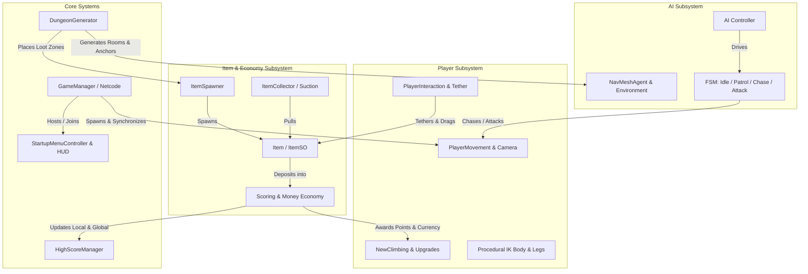
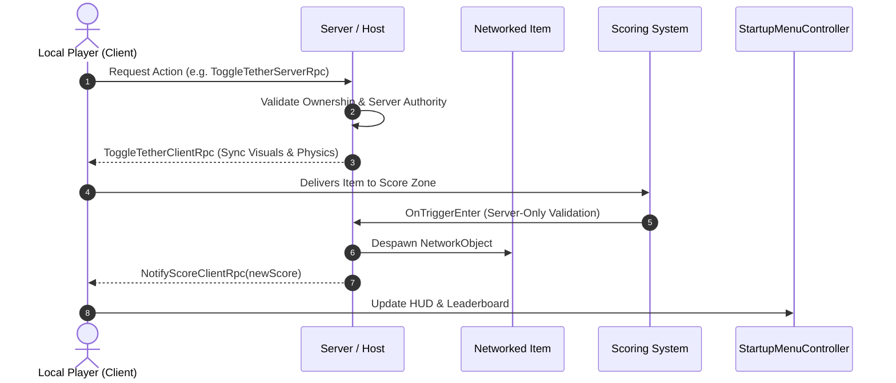
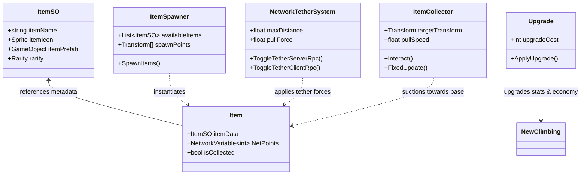
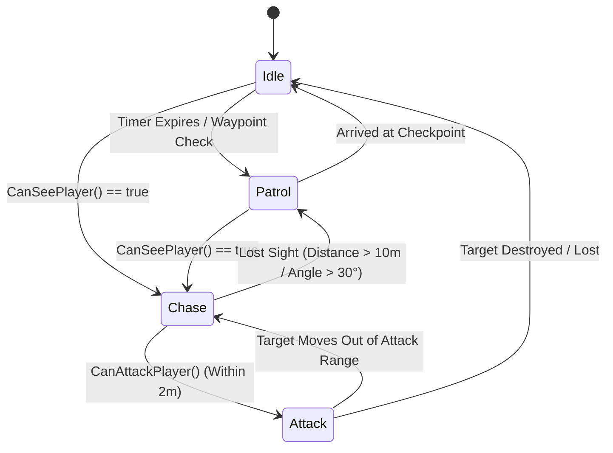
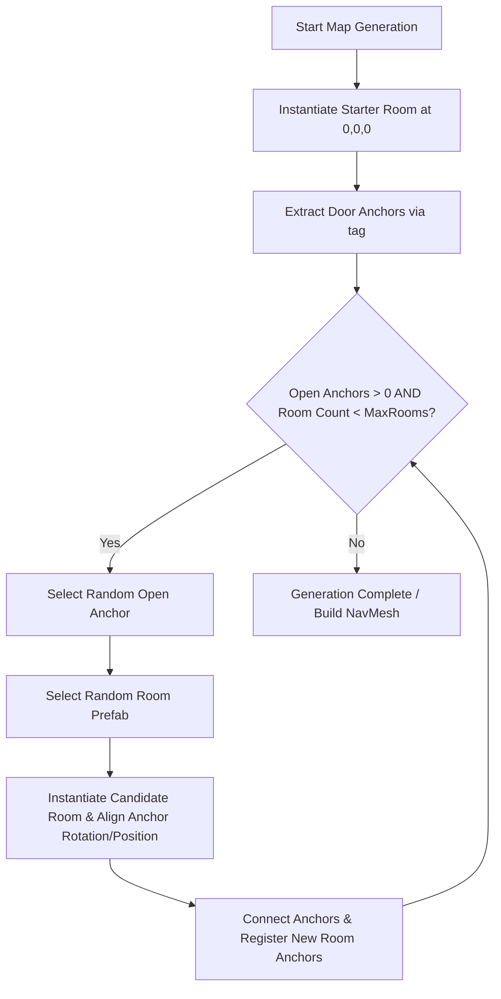

# Lootbugs - Architecture & Project Structure Guide

> **Project Name**: `Lootbugs`  
> **Engine**: Unity 6 (`6000.3.8f1`)  
> **Render Pipeline**: High Definition Render Pipeline (HDRP `17.3.0`)  
> **Networking**: Netcode for GameObjects (NGO `2.11.2`) + Unity Services Multiplayer + Vivox Voice  

---

## 1. Executive Overview

**Lootbugs** is a multiplayer cooperative first-person scavenging and extraction game. Players navigate modular procedural underground dungeons, climb surfaces, tether and collect valuable loot items with physical mechanics, avoid and combat hostile AI enemies, and bank high scores while upgrading abilities.



---

## 2. Technology Stack & Specifications

| Layer | Technology / Package | Version | Purpose |
| :--- | :--- | :--- | :--- |
| **Game Engine** | Unity 6 Editor | `6000.3.8f1` | Core engine runtime, physics, and tooling |
| **Graphics & Rendering** | High Definition Render Pipeline (HDRP) | `17.3.0` | High-fidelity lighting, volumetrics, and shaders |
| **Networking Architecture** | Netcode for GameObjects (NGO) | `2.11.2` | Server-authoritative state synchronization & RPCs |
| **Multiplayer Services** | Unity Services Multiplayer / Relay | `2.2.2` | Session relay and lobby matchmaking |
| **Voice Communication** | Vivox Voice Chat | `16.10.0` | In-game 3D positional voice chat |
| **AI & Navigation** | Unity AI Navigation | `2.0.12` | Runtime NavMesh surfaces, agent pathfinding |
| **Input Management** | Unity New Input System | `1.18.0` | Action-based input mapping & cross-platform input |
| **UI Framework** | TextMeshPro & Unity UI | `1.0.0` | Responsive menus, in-game HUDs, billboard nametags |

---

## 3. Detailed Subsystem Architecture

### 3.1 Multiplayer & Networking Layer (`Assets/Scripts/Multiplayer/`)
The multiplayer architecture follows a **Server-Authoritative / Client-Predicted** model using Netcode for GameObjects.

- **[GameManager.cs](file:///e:/github/Lootbugs/Assets/Scripts/Multiplayer/GameManager.cs)**:
  - Singleton `NetworkBehaviour` managing host startup (`ConnectHost`), client connection (`ConnectClient`), and shutdown (`Disconnect`).
- **[NetworkLookAtCanvas.cs](file:///e:/github/Lootbugs/Assets/Scripts/Multiplayer/NetworkLookAtCanvas.cs)**:
  - Billboards world-space UI canvases (player overhead info, item prompts) to orient toward the local active camera.
- **[Scoring.cs](file:///e:/github/Lootbugs/Assets/Scripts/Scoring.cs)**:
  - Server-authoritative collection zone. Validates deposited items on the host, fires `NotifyScoreClientRpc`, credits player currency, and despawns networked item instances.
- **[Tether.cs (NetworkTetherSystem)](file:///e:/github/Lootbugs/Assets/Scripts/Inventory/Tether.cs)**:
  - Synchronizes grappling lines and physical pull forces across network clients using `ToggleTetherServerRpc` and `ToggleTetherClientRpc`.



---

### 3.2 Player & Movement Subsystem (`Assets/Scripts/PlayerMovement/`)
The player controller incorporates high-mobility physical movement, surface alignment, climbing, and procedural animation.

- **[PlayerMovement.cs](file:///e:/github/Lootbugs/Assets/Scripts/PlayerMovement/PlayerMovement.cs)**:
  - First-person rigidbody controller handling walking, sprinting, crouching, jumping, slope drag, and ground raycasts.
- **[PlayerCam.cs](file:///e:/github/Lootbugs/Assets/Scripts/PlayerMovement/PlayerCam.cs) & [MoveCamera.cs](file:///e:/github/Lootbugs/Assets/Scripts/PlayerMovement/MoveCamera.cs)**:
  - Mouse look rotation, field-of-view adjustments, camera transform smoothing.
- **[Climbing.cs](file:///e:/github/Lootbugs/Assets/Scripts/PlayerMovement/Climbing.cs) & [NewClimbing.cs](file:///e:/github/Lootbugs/Assets/Scripts/PlayerMovement/NewClimbing.cs)**:
  - Surface normal raycasting enabling wall and ceiling climbing mechanics.
  - Tracks player stamina, currency (`Money`), and upgrade multipliers (`gainMultiplier`).
- **[PlayerInteraction.cs](file:///e:/github/Lootbugs/Assets/Scripts/PlayerMovement/PlayerInteraction.cs)** & **[IInteractable.cs](file:///e:/github/Lootbugs/Assets/Scripts/IInteractable.cs)**:
  - Center-screen raycasting interface for triggering interactable scene objects.
- **Procedural IK Animation (`Procedural Movement/`)**:
  - **[BodyController.cs](file:///e:/github/Lootbugs/Assets/Scripts/PlayerMovement/Procedural%20Movement/BodyController.cs)**: Computes multi-legged bug body height, tilt, and roll based on underlying terrain normal vectors.
  - **[LegAimGrounding.cs](file:///e:/github/Lootbugs/Assets/Scripts/PlayerMovement/Procedural%20Movement/LegAimGrounding.cs)**: Raycasts leg targets down to the ground to drive realistic procedural foot placements.

---

### 3.3 Item, Inventory & Economy Subsystem (`Assets/Scripts/Inventory/`)
Manages ScriptableObject item definitions, dynamic room loot spawning, physical tethering, and suction mechanics.



- **[ItemSO.cs](file:///e:/github/Lootbugs/Assets/Scripts/Inventory/ItemSO.cs)**: ScriptableObject data container defining item names, icons, prefabs, and rarity tiers (`common`, `uncommon`, `rare`, `epic`, `legendary`).
- **[Item.cs](file:///e:/github/Lootbugs/Assets/Scripts/Inventory/Item.cs)**: In-world item entity holding synchronized point values (`NetPoints`).
- **[ItemSpawner.cs](file:///e:/github/Lootbugs/Assets/Scripts/Inventory/ItemSpawner.cs)**: Spawns loot dynamically at predefined anchor points inside spawned rooms.
- **[ItemCollector.cs](file:///e:/github/Lootbugs/Assets/Scripts/ItemCollector.cs)**: Suction funnel pulling nearby items toward a target collector position via Rigidbody movement.
- **[Tether.cs](file:///e:/github/Lootbugs/Assets/Scripts/Inventory/Tether.cs)**: Grappling tether mechanics connecting players to objects with real-time `LineRenderer` visual feedback.
- **[Upgrade.cs](file:///e:/github/Lootbugs/Assets/Scripts/Inventory/Upgrade.cs)**: Economy shop allowing players to spend collected currency on movement speed and score multipliers.

---

### 3.4 Enemy AI & Navigation Subsystem (`Assets/Scripts/Enemy/`)
The AI system is built on a modular **Finite State Machine (FSM)** decoupled from physics, integrated with Unity's NavMesh Navigation package.



- **[AI.cs](file:///e:/github/Lootbugs/Assets/Scripts/Enemy/AI.cs)**: MonoBehaviour component hosting the `NavMeshAgent`, `Animator`, and active `State` processor.
- **[State.cs](file:///e:/github/Lootbugs/Assets/Scripts/Enemy/states/State.cs)**: FSM base class providing `Enter`, `Update`, `Exit` lifecycle hooks, field-of-view cone calculations (`CanSeePlayer`), and proximity checks (`CanAttackPlayer`).
- **State Implementations**:
  - **[Idle.cs](file:///e:/github/Lootbugs/Assets/Scripts/Enemy/states/Idle.cs)**: Stationary state scanning for players; switches to patrol.
  - **[Patrol.cs](file:///e:/github/Lootbugs/Assets/Scripts/Enemy/states/Patrol.cs)**: Moves between waypoints retrieved from `GameEnviroment.Singleton`.
  - **[Chase.cs](file:///e:/github/Lootbugs/Assets/Scripts/Enemy/states/Chase.cs)**: Aggressive high-speed pursuit toward the detected player transform.
  - **[Attack.cs](file:///e:/github/Lootbugs/Assets/Scripts/Enemy/states/Attack.cs)**: Executes melee strikes when in proximity.
- **[GameEnviroment.cs](file:///e:/github/Lootbugs/Assets/Scripts/Enemy/GameEnviroment.cs)**: Singleton registry caching scene navigation checkpoints (`Checkpoint` tag).

---

### 3.5 Procedural Map Generation (`Assets/Scripts/MapGeneration/`)

- **[DungeonGenerator.cs](file:///e:/github/Lootbugs/Assets/Scripts/MapGeneration/DungeonGenerator.cs)**:
  - Generates connected modular dungeon layouts at runtime.
  - Starts with an initial room prefab and discovers open door anchors tagged with `doorTag`.
  - Iteratively spawns room prefabs, calculating opposite rotation vectors (`Quaternion.LookRotation(-targetAnchor.forward, Vector3.up)`) and offset translations so door frames connect seamlessly.



---

### 3.6 UI & High Score System (`Assets/Scripts/UI/`)

- **[StartupMenuController.cs](file:///e:/github/Lootbugs/Assets/Scripts/UI/StartupMenuController.cs)**:
  - Unified UI manager handling the Main Menu, Host/Join buttons, Controls screen, Pause menu, and In-Game HUD (Score, High Score badge, Network status).
- **[HighScoreManager.cs](file:///e:/github/Lootbugs/Assets/Scripts/UI/HighScoreManager.cs)**:
  - Persistent JSON-based high score storage using `PlayerPrefs`.
  - Maintains top scores with player names and timestamps, triggering events when records are broken.

---

## 4. Repository Directory Structure

```
Lootbugs/
├── Assets/
│   ├── Blocks/                      # Modular geometric block assets & level geometry
│   ├── LeartesStudios/              # Environment art assets & 3D modular meshes
│   ├── Materials/                   # Global HDRP physical materials and shaders
│   ├── prefabs/                     # Reusable game entities
│   │   ├── Items/                   # Collectible loot prefabs (Common to Legendary)
│   │   ├── Rooms/                   # Modular room prefabs with door connector anchors
│   │   └── Player.prefab            # Networked player prefab with cameras & controllers
│   ├── Scenes/                      # Unity Scene files
│   │   └── SampleScene.unity        # Main game world containing GameManager & UI Canvas
│   ├── Scripts/                     # C# Source Code
│   │   ├── Enemy/                   # Enemy AI, FSM, and navigation
│   │   │   ├── states/              # State implementations (Idle, Patrol, Chase, Attack)
│   │   │   ├── AI.cs                # Core AI MonoBehaviour
│   │   │   └── GameEnviroment.cs    # Checkpoint registry singleton
│   │   ├── Inventory/               # Loot, items, upgrades, and tether mechanics
│   │   │   ├── Interact.cs          # Generic interaction trigger
│   │   │   ├── Item.cs              # Networked item instance
│   │   │   ├── ItemSO.cs            # Item ScriptableObject definition
│   │   │   ├── ItemSpawner.cs       # Room item placement controller
│   │   │   ├── StringManager.cs     # Rope / line utilities
│   │   │   ├── Tether.cs            # Networked tethering physics
│   │   │   └── Upgrade.cs           # Player upgrade shop controller
│   │   ├── MapGeneration/           # Procedural dungeon generation
│   │   │   └── DungeonGenerator.cs  # Anchor-based modular room generator
│   │   ├── Multiplayer/             # Netcode & networking logic
│   │   │   ├── GameManager.cs       # Network session lifecycle manager
│   │   │   └── NetworkLookAtCanvas.cs # Billboard UI controller
│   │   ├── PlayerMovement/          # Character controllers, cameras, and procedural IK
│   │   │   ├── Procedural Movement/ # Bug procedural animation
│   │   │   │   ├── BodyController.cs # Dynamic body height & tilt solver
│   │   │   │   └── LegAimGrounding.cs# Raycast leg grounding solver
│   │   │   ├── Climbing.cs          # Wall surface climbing
│   │   │   ├── MoveCamera.cs        # Camera position follow
│   │   │   ├── NewClimbing.cs       # Advanced climbing & stamina/money
│   │   │   ├── PlayerCam.cs         # First-person mouse look
│   │   │   ├── PlayerInteraction.cs # Player raycast interaction
│   │   │   ├── PlayerMovement.cs    # Rigidbody first-person movement
│   │   │   └── RotatePlayer.cs      # Player orientation helper
│   │   ├── UI/                      # User interface controllers
│   │   │   ├── HighScoreManager.cs  # JSON leaderboard persistence
│   │   │   └── StartupMenuController.cs # Main menu, HUD, and pause controller
│   │   ├── IInteractable.cs         # Interactable interface contract
│   │   ├── ItemCollector.cs         # Suction collection zone
│   │   └── Scoring.cs               # Score deposit & money distribution
│   ├── Settings/                    # HDRP Graphics & Volume settings
│   └── TextMesh Pro/                # TMP Fonts and styles
├── Packages/                        # Unity Package Manager manifest & lock
├── ProjectSettings/                 # Unity Engine Project Settings (Input, Physics, Graphics)
├── AGENTS.md                        # Master AI Agent Guidelines (System Prompt)
├── ARCHITECTURE.md                  # Project Architecture and Structural Documentation
└── UNITY.md                         # Dedicated Unity Reference Rules
```

---

## 5. Architectural Patterns & Best Practices

1. **Server Authority**:
   - Critical state operations (scoring, item despawning, tether binding) are verified and processed on the Server/Host before executing ClientRPCs to ensure cheat-free, synchronized gameplay.
2. **State Machine Decoupling**:
   - Enemy AI logic is completely isolated inside state classes (`Idle`, `Patrol`, `Chase`, `Attack`) deriving from `State.cs`, keeping `AI.cs` clean and maintainable.
3. **Data-Driven Design via ScriptableObjects**:
   - Items and loot properties are defined in `ItemSO` assets rather than hardcoded in scripts, making tuning, adding new loot tiers, and adjusting drop rates straightforward in the Inspector.
4. **Procedural Kinematics**:
   - The bug character utilizes procedural IK (`BodyController` + `LegAimGrounding`) to adapt smoothly to uneven terrain, rocky surfaces, and walls without requiring complex baked animation trees.
5. **Zero-Alloc Hot Paths**:
   - Per-frame loops (`Update`, `FixedUpdate`) minimize GC pressure by avoiding LINQ, string concatenations, or dynamic allocations.
